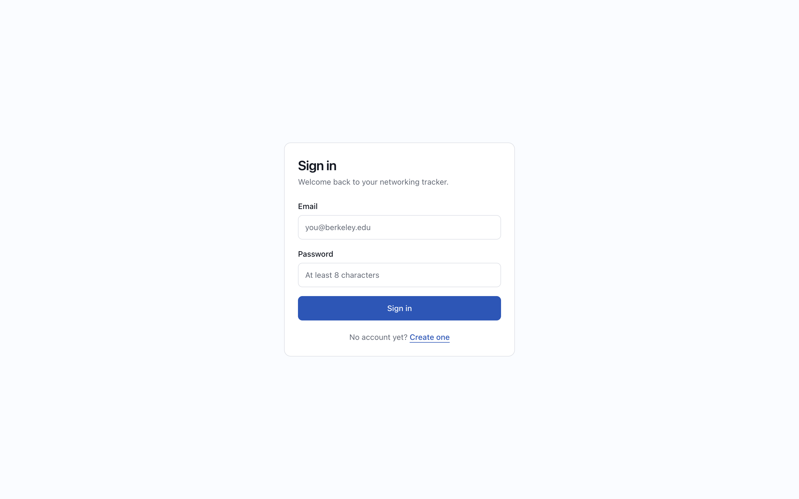
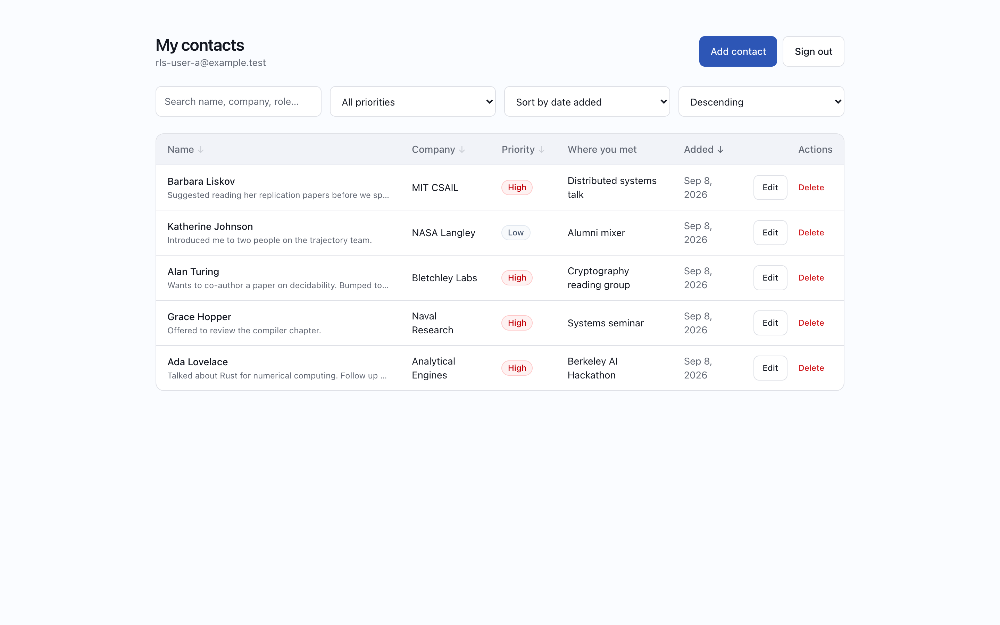
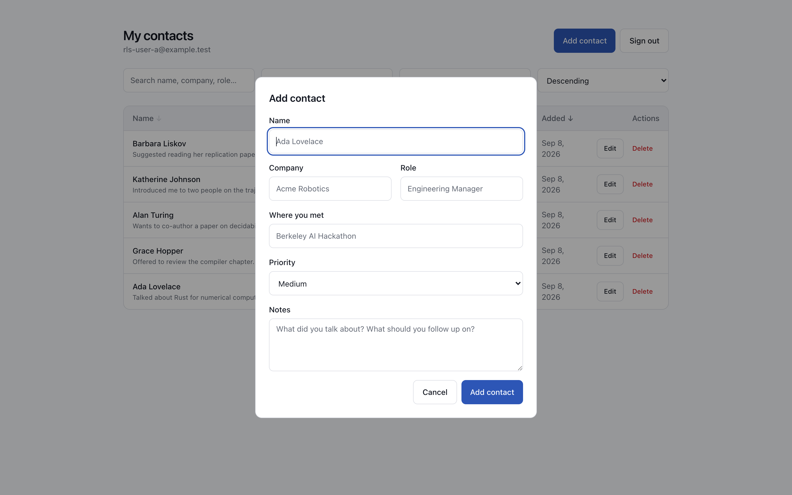
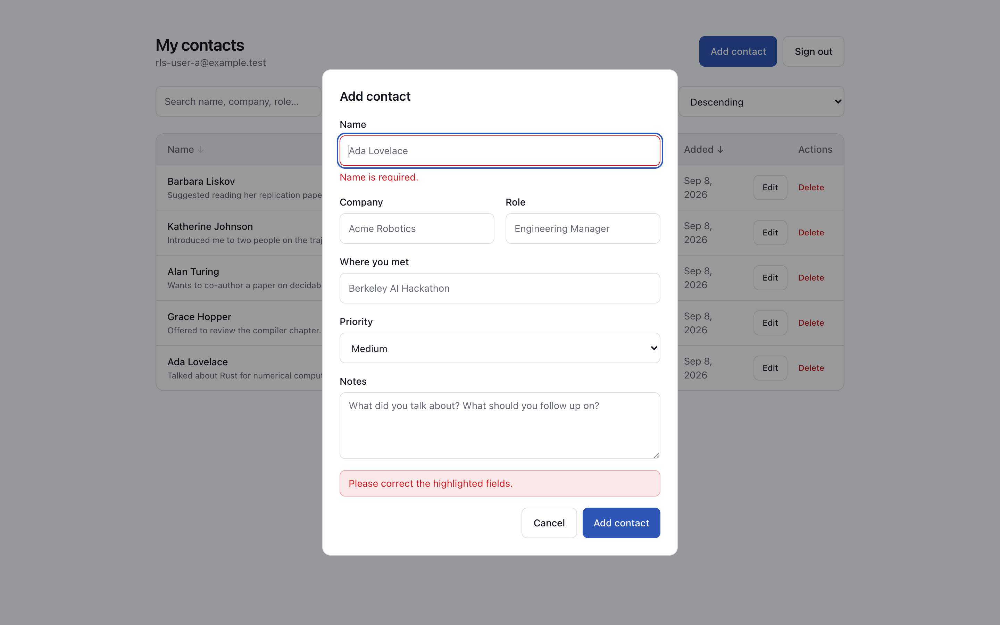
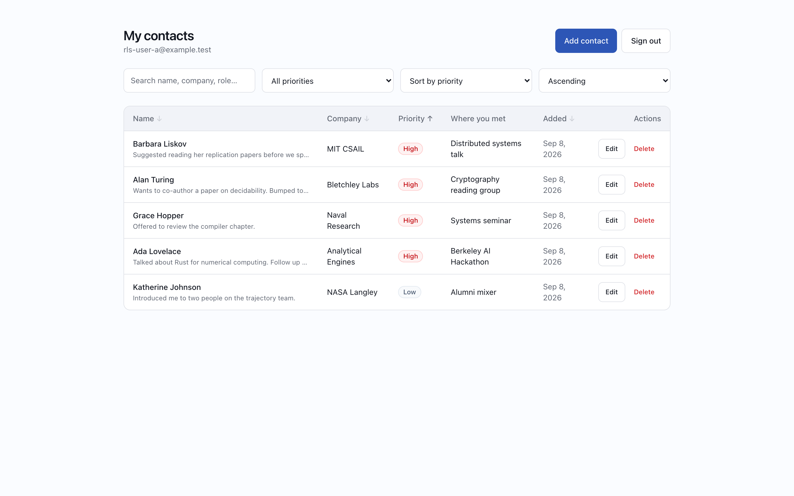
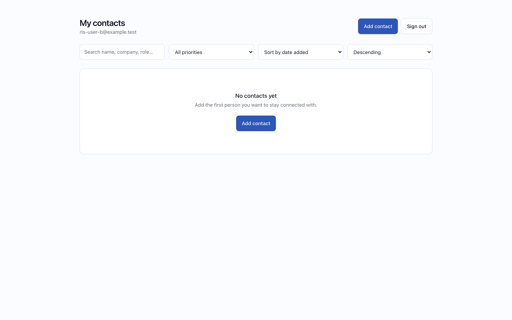
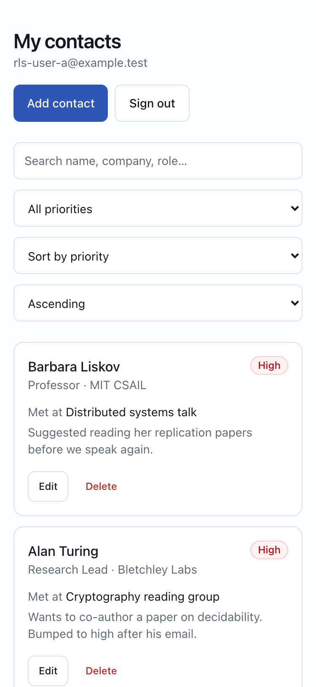

# Secure Networking Tracker

A private, per-user networking tracker for the people you want to stay connected with at
Berkeley. You sign in with an email and password, add the people you meet — their name,
company, role, where you met, freeform notes, and a follow-up priority — and then sort,
filter, and search that list as it grows. Every contact belongs to exactly one account, and
that ownership is enforced by Row Level Security inside Postgres rather than by application
code, so one user's data is unreachable by another user even if the API layer is bypassed
entirely.

**Live app:** <https://networking-tracker-puce.vercel.app>

---

## Contents

- [Features](#features)
- [Screenshots](#screenshots)
- [Technology stack](#technology-stack)
- [Architecture](#architecture)
- [Database schema](#database-schema)
- [Authentication and RLS ownership](#authentication-and-rls-ownership)
- [Local setup](#local-setup)
- [Environment variables](#environment-variables)
- [Testing](#testing)
- [Deployment](#deployment)
- [Grading evidence](#grading-evidence)
- [Known limitations](#known-limitations)

---

## Features

- Email/password sign-up, sign-in, and sign-out via Neon Managed Better Auth
- Add a contact with name, company, role, where you met, notes, and priority
- Priority is constrained to `high`, `medium`, or `low` at three layers (UI, API, database)
- View contacts as a sortable table on desktop and stacked cards on mobile
- Sort by name, company, priority, or date added, ascending or descending
- Filter by priority and search across name, company, role, and where you met
- Edit and delete your own contacts
- Data persists in Neon Postgres and survives a browser refresh
- Explicit loading, empty, success, and error states
- Responsive from 375px phones to widescreen desktops
- Server-side validation with clear, per-field error messages
- Row Level Security so no user can read or modify another user's contacts

## Screenshots

| | |
|---|---|
| **Sign in** — email and password, with a link to create an account.<br> | **Contact list** — sortable, filterable, searchable.<br> |
| **Add / edit dialog** — the same form serves both.<br> | **Invalid input fails safely** — a blank name is rejected by the *server* with a field-level message.<br> |
| **Sorted by priority** — high → medium → low, not alphabetical.<br> | **User B sees none of User A's contacts** — same table, different account.<br> |

The mobile layout at 375px, where the table becomes cards:



These are generated rather than hand-taken: `npm run screenshots` drives a real Chrome,
signs in as both fixture accounts, and writes the files to `docs/screenshots/`. Every image
above was captured against **the deployed Vercel app**, not a local server:

```bash
APP_URL=https://networking-tracker-puce.vercel.app npm run screenshots
```

Because the script signs in, opens the dialog, submits invalid input, re-sorts, signs out,
and signs back in as a second account, a clean run is itself an end-to-end check of the
live deployment. Omit `APP_URL` to capture against `localhost:3000` instead.

## Technology stack

| Layer | Choice | Why |
| --- | --- | --- |
| Framework | Next.js (App Router) | Lets the frontend and the backend live in one deployable while staying genuinely separate — React components in `app/`, trusted server code in `app/api/`. |
| Language | TypeScript | The `Contact` and `Priority` types are shared by the validation layer, the API routes, and the UI, so a schema change surfaces as a compile error rather than a runtime bug. |
| Styling | Tailwind CSS v4 with a small in-repo component system (`components/ui/`) | Design tokens are defined once in `app/globals.css`; the primitives wrap them so spacing, colour, and touch-target sizing stay consistent. |
| Validation | Zod | One schema module (`lib/validation.ts`) is both the runtime guard in the API routes and the unit under test. |
| Database | Neon Postgres | Serverless Postgres with real RLS, which is what the security model depends on. |
| Auth | Neon Managed Better Auth | Hosted session management, issuing the JWT that Postgres reads via `auth.user_id()`. |
| Data access | Neon Data API via `@neondatabase/neon-js` | An HTTPS PostgREST endpoint that runs every query as the `authenticated` role with the caller's identity attached, so RLS applies to every request. |
| Hosting | Vercel | First-class Next.js support and per-environment secret management. |
| Testing | Vitest | Fast, native ESM and TypeScript, no extra build step. |

## Architecture

```
┌─────────────────────────────────────────────┐
│ Browser — React client components           │
│                                             │
│  sign in / sign up / sign out ──────────────┼──► Neon Managed Better Auth
│                                             │      (issues session + JWT)
│  reads the session JWT                      │
│  fetch('/api/contacts',                     │
│        Authorization: Bearer <token>)       │
└──────────────────┬──────────────────────────┘
                   │
                   ▼
┌─────────────────────────────────────────────┐
│ Next.js Route Handlers  (the backend)       │
│  app/api/contacts/route.ts                  │
│  app/api/contacts/[id]/route.ts             │
│                                             │
│  • require a bearer token          → 401    │
│  • validate the body with Zod      → 400    │
│  • whitelist sort / filter params           │
│  • strip any client-supplied user_id        │
└──────────────────┬──────────────────────────┘
                   │  neon-js client created with
                   │  dataApi.getToken → the caller's token
                   ▼
┌─────────────────────────────────────────────┐
│ Neon Data API                               │
│  verifies the JWT signature                 │
│  sets role = authenticated                  │
│  populates auth.user_id()                   │
└──────────────────┬──────────────────────────┘
                   ▼
┌─────────────────────────────────────────────┐
│ Neon Postgres — contacts table              │
│  RLS: auth.user_id() = user_id              │
│  CHECK constraints on name and priority     │
└─────────────────────────────────────────────┘
```

**Frontend** (`app/page.tsx`, `app/sign-in/`, `app/contacts/`, `components/`) is React client
components. It talks to Better Auth directly for sign-in and sign-out, and to its own API
for everything involving contact data. It holds no database credentials.

**Backend** (`app/api/contacts/`) is the trust boundary. Every handler requires a bearer
token, validates the request body with Zod before any database call, and whitelists the
sort column and priority filter so no user-controlled string reaches the query. Requests are
executed with a client built from the caller's token alone — there is no service key or
admin connection anywhere in the server code, so no code path can bypass RLS.

**Database and auth** are Neon Postgres and Neon Managed Better Auth. The critical detail is
that the API layer never adds `WHERE user_id = ...`. It asks for "the contacts" and Postgres
returns only the caller's, because RLS rewrites the query. That is what makes the two-account
test in `tests/rls.integration.test.ts` meaningful: it hits the Data API directly, skipping
the API layer completely, and still cannot see another user's rows.

**Hosting** is Vercel. Public `NEXT_PUBLIC_*` URLs are inlined into the browser bundle.
`DATABASE_URL` is server-side only — and is not set in Vercel at all, because the running
application never opens a direct Postgres connection. It is used solely by the local
`db:push` and `db:verify` scripts. The deployment therefore holds no credential capable of
bypassing RLS.

There is deliberately no auth cookie secret in this project: Neon Managed Better Auth runs
the auth service and owns its own signing keys, so the application never holds one.

## Database schema

Full DDL: [`db/schema.sql`](db/schema.sql).

### `contacts`

| Column | Type | Constraints | Notes |
| --- | --- | --- | --- |
| `id` | `uuid` | PK, `default gen_random_uuid()` | |
| `user_id` | `text` | `not null`, `default (auth.user_id())` | Owner. Filled by Postgres from the verified JWT; never sent by the client. |
| `name` | `text` | `not null`, non-blank, ≤ 120 chars | |
| `company` | `text` | nullable, ≤ 120 chars | |
| `role` | `text` | nullable, ≤ 120 chars | |
| `met_at` | `text` | nullable, ≤ 200 chars | Where you met. |
| `notes` | `text` | nullable, ≤ 2000 chars | |
| `priority` | `text` | `not null`, `default 'medium'`, must be `high`/`medium`/`low` | |
| `created_at` | `timestamptz` | `not null`, `default now()` | |
| `updated_at` | `timestamptz` | `not null`, `default now()` | Maintained by a trigger. |
| `priority_rank` | `int` | generated, stored | `high`→1, `medium`→2, `low`→3, so sorting by priority is meaningful rather than alphabetical. |

Table constraints:

- `contacts_name_not_blank` — `length(btrim(name)) > 0`
- `contacts_name_max_len` — `length(name) <= 120`
- `contacts_priority_valid` — `priority in ('high','medium','low')`

These mirror the Zod rules on purpose. Even a caller who skips the API entirely and posts
straight to the Data API cannot store a blank name or an invalid priority.

## Authentication and RLS ownership

Signing in with Better Auth returns a session containing a JWT. The browser attaches that
token to each request to `/api/contacts`; the route handler forwards it to the Neon Data API,
which verifies the signature, maps the request to the `authenticated` Postgres role, and makes
the user's ID available as `auth.user_id()`.

The ownership rule is one expression, applied four times:

```sql
alter table contacts enable row level security;
alter table contacts force row level security;

create policy contacts_select on contacts for select to authenticated
  using (auth.user_id() = user_id);

create policy contacts_insert on contacts for insert to authenticated
  with check (auth.user_id() = user_id);

create policy contacts_update on contacts for update to authenticated
  using (auth.user_id() = user_id)
  with check (auth.user_id() = user_id);

create policy contacts_delete on contacts for delete to authenticated
  using (auth.user_id() = user_id);
```

Three details matter:

1. **`USING` vs `WITH CHECK`.** `USING` decides which existing rows an operation may target.
   `WITH CHECK` decides what a row is allowed to look like afterwards. The `UPDATE` policy
   carries both, which is what stops a user from editing one of their own rows and setting
   `user_id` to somebody else's — the row would pass `USING` but fail `WITH CHECK`.
2. **Inserts never carry `user_id`.** The API strips it (Zod discards unknown keys) and the
   column defaults to `auth.user_id()`, so a row is stamped with the authenticated caller by
   construction rather than by trusting input.
3. **Grants are separate from policies.** RLS narrows access but grants open the door at all.
   `authenticated` is granted `select, insert, update, delete` on `contacts`; `anonymous` is
   explicitly granted nothing, so an unauthenticated request to the Data API returns nothing.

A read for another user's row is not an error — it simply matches zero rows. The API turns
that into a `404`, which avoids confirming that someone else's contact exists.

### Verifying it, rather than trusting the file

`db/schema.sql` states an intention; it does not prove what the database is doing.
`npm run db:verify` connects to the live database and reads the Postgres catalog directly
(`pg_class`, `pg_policy`, `information_schema.role_table_grants`, `pg_constraint`), so the
output below is what is *actually enforced* right now:

```
Row Level Security flags
┌────────────┬─────────────┬────────────┐
│ table      │ rls_enabled │ rls_forced │
├────────────┼─────────────┼────────────┤
│ 'contacts' │ true        │ true       │
└────────────┴─────────────┴────────────┘

Policies (one per command, as the rubric requires)
┌───────────────────┬──────────┬──────────────────────────────┬──────────────────────────────┐
│ policy            │ command  │ using_clause                 │ with_check_clause            │
├───────────────────┼──────────┼──────────────────────────────┼──────────────────────────────┤
│ 'contacts_delete' │ 'DELETE' │ '(auth.user_id() = user_id)' │ null                         │
│ 'contacts_insert' │ 'INSERT' │ null                         │ '(auth.user_id() = user_id)' │
│ 'contacts_select' │ 'SELECT' │ '(auth.user_id() = user_id)' │ null                         │
│ 'contacts_update' │ 'UPDATE' │ '(auth.user_id() = user_id)' │ '(auth.user_id() = user_id)' │
└───────────────────┴──────────┴──────────────────────────────┴──────────────────────────────┘

Table grants by role
┌─────────────────┬─────────────────────────────────────────────────────────────────┐
│ grantee         │ privileges                                                      │
├─────────────────┼─────────────────────────────────────────────────────────────────┤
│ 'authenticated' │ 'DELETE, INSERT, SELECT, UPDATE'                                │
│ 'neondb_owner'  │ 'DELETE, INSERT, REFERENCES, SELECT, TRIGGER, TRUNCATE, UPDATE' │
└─────────────────┴─────────────────────────────────────────────────────────────────┘

CHECK constraints
┌───────────────────────────┬───────────────────────────────────────────────────────────────────────────────┐
│ constraint                │ definition                                                                    │
├───────────────────────────┼───────────────────────────────────────────────────────────────────────────────┤
│ 'contacts_name_max_len'   │ 'CHECK ((length(name) <= 120))'                                               │
│ 'contacts_name_not_blank' │ 'CHECK ((length(btrim(name)) > 0))'                                           │
│ 'contacts_priority_valid' │ "CHECK ((priority = ANY (ARRAY['high'::text, 'medium'::text, 'low'::text])))" │
└───────────────────────────┴───────────────────────────────────────────────────────────────────────────────┘

user_id column definition
┌─────────────┬───────────┬─────────────┬──────────────────┐
│ column_name │ data_type │ is_nullable │ column_default   │
├─────────────┼───────────┼─────────────┼──────────────────┤
│ 'user_id'   │ 'text'    │ 'NO'        │ 'auth.user_id()' │
└─────────────┴───────────┴─────────────┴──────────────────┘
```

Four policies, one per command. `UPDATE` is the only one carrying both clauses, which is
exactly the pairing that blocks row reassignment. `anonymous` appears nowhere in the grants
table, so an unauthenticated request is refused before RLS is even consulted.

## Local setup

**Prerequisites:** Node.js 20+, npm, and a free Neon account.

```bash
git clone <this-repo-url>
cd NetworkingTracker
npm install
```

### 1. Create the Neon project

1. In the [Neon Console](https://console.neon.tech), create a new project.
2. Open **Auth** and enable **Managed Better Auth**. Copy the **Auth URL**.
3. Open **Data API** and enable it. Copy the **Data API URL**.
4. Under **Data API → Settings → CORS allowed origins**, add `http://localhost:3000`
   (and your Vercel domain once deployed).
5. Copy the pooled connection string from **Connection Details**.

### 2. Configure environment variables

```bash
cp .env.example .env.local
```

Fill in the values you copied above. `.env.local` is gitignored.

### 3. Apply the schema

```bash
npm run db:push
```

This runs [`db/schema.sql`](db/schema.sql) over the connection in `DATABASE_URL` (no
`psql` install required). It must run *after* Better Auth and the Data API are enabled,
since it depends on the `auth` schema and the `authenticated` role already existing. The
script is idempotent, so it is safe to re-run.

You can also paste the file into the Neon **SQL Editor** if you prefer.

Then confirm what actually landed in the database:

```bash
npm run db:verify
```

### 4. Run

```bash
npm run dev          # http://localhost:3000
npm test             # the full test suite
npm run build        # production build
```

Two optional helpers:

```bash
npm run test:users   # create the two RLS fixture accounts (idempotent)
npm run seed:demo    # add a few contacts to User A via the app's own API
```

## Environment variables

Names only — see [`.env.example`](.env.example) for the placeholder file.

| Variable | Scope | Purpose |
| --- | --- | --- |
| `NEXT_PUBLIC_NEON_AUTH_URL` | Public | Better Auth endpoint used by the browser. |
| `NEXT_PUBLIC_NEON_DATA_API_URL` | Public | Data API base URL. |
| `NEON_DATA_API_URL` | **Server only** | Data API URL used by the route handlers. |
| `DATABASE_URL` | **Server only** | Pooled owner connection string. Used *only* by `db:push` and `db:verify`; never set in Vercel. |
| `APP_URL` | Local tooling | Origin the `scripts/` helpers send. Better Auth rejects requests with no `Origin`, and Neon only accepts allow-listed ones. Defaults to `http://localhost:3000`. |
| `TEST_USER_A_EMAIL` / `TEST_USER_A_PASSWORD` | Test fixture | Optional; enables the RLS integration test. |
| `TEST_USER_B_EMAIL` / `TEST_USER_B_PASSWORD` | Test fixture | Optional; enables the RLS integration test. |

The two public URLs are safe to expose, and that is a design decision rather than a
concession: they are reachable from the browser by necessity, and every row behind them is
gated by RLS. A leaked URL grants nothing without a valid JWT, and a valid JWT only ever
reaches its own rows.

`DATABASE_URL` is the one true secret here — it connects as the table owner and bypasses
RLS. It is referenced by nothing under `app/` or `components/`, is gitignored, is absent
from the git history, and is deliberately **not** configured in Vercel.

## Testing

```bash
npm test
```

Three suites:

**`tests/validation.test.ts`** — unit tests for `lib/validation.ts`. Covers the rubric's
validation rules directly: an empty name is rejected with `"Name is required."`, a
whitespace-only name is rejected, a missing name is rejected, an over-long name is rejected,
each of `high`/`medium`/`low` is accepted, anything else (`"urgent"`, a number) is rejected
with `"Priority must be one of: high, medium, low."`, blank optional fields normalise to
`null`, and `user_id` is stripped from both create and update payloads.

**`tests/api-validation.test.ts`** — tests the route handlers with the Neon client mocked,
proving the backend is a real trust boundary: a request with no bearer token gets a `401`
and never constructs a database client; an empty name or invalid priority gets a `400` and
`insert` is never called; malformed JSON gets a `400`; a client-supplied `user_id` never
reaches the insert; and the list query never filters by `user_id` in application code,
because that is RLS's job.

**`tests/rls.integration.test.ts`** — the two-account privacy proof, run against live Neon
over plain HTTP with the Next.js layer bypassed entirely. Skipped automatically unless the
`TEST_USER_*` variables are set. Asserts that User A can read their own contact, User B
cannot read, update, or delete it, User A cannot reassign a row to another user, and an
anonymous request is rejected outright rather than merely returning an empty list. The probe
row it creates is deleted afterwards, so runs leave no residue.

Because this file skips the application entirely, passing it means ownership is enforced in
Postgres. Nothing else is left that could be enforcing it.

The suite adapts to its environment: with no `.env.local` present, the integration file
skips itself and the other 33 tests still run, so a fresh clone is never red. With
credentials, all 40 run.

### Test output

```
$ npm test

 RUN  v4.1.11

 ✓ tests/validation.test.ts > parseCreateContact > accepts a fully populated contact 2ms
 ✓ tests/validation.test.ts > parseCreateContact > rejects an empty name with a clear message 1ms
 ✓ tests/validation.test.ts > parseCreateContact > rejects a whitespace-only name 0ms
 ✓ tests/validation.test.ts > parseCreateContact > rejects a missing name 0ms
 ✓ tests/validation.test.ts > parseCreateContact > rejects an invalid priority with a clear message 0ms
 ✓ tests/validation.test.ts > parseCreateContact > accepts the 'high' priority 0ms
 ✓ tests/validation.test.ts > parseCreateContact > accepts the 'medium' priority 0ms
 ✓ tests/validation.test.ts > parseCreateContact > accepts the 'low' priority 0ms
 ✓ tests/validation.test.ts > parseCreateContact > rejects a non-string priority 0ms
 ✓ tests/validation.test.ts > parseCreateContact > trims the name and normalises blank optional fields to null 0ms
 ✓ tests/validation.test.ts > parseCreateContact > defaults omitted optional fields to null 0ms
 ✓ tests/validation.test.ts > parseCreateContact > rejects an over-long name 0ms
 ✓ tests/validation.test.ts > parseCreateContact > strips user_id so a client cannot choose the owner of a row 0ms
 ✓ tests/validation.test.ts > parseCreateContact > rejects non-object bodies 0ms
 ✓ tests/validation.test.ts > parseUpdateContact > returns only the fields that were actually sent 1ms
 ✓ tests/validation.test.ts > parseUpdateContact > preserves an explicit null so a field can be cleared 0ms
 ✓ tests/validation.test.ts > parseUpdateContact > rejects an empty patch 0ms
 ✓ tests/validation.test.ts > parseUpdateContact > rejects blanking a name that is being updated 0ms
 ✓ tests/validation.test.ts > parseUpdateContact > rejects an invalid priority 0ms
 ✓ tests/validation.test.ts > parseUpdateContact > strips user_id so a row cannot be reassigned to another user 0ms
 ✓ tests/validation.test.ts > parseUpdateContact > rejects a patch containing only unknown keys 0ms
 ✓ tests/validation.test.ts > parseSort > defaults to newest first 0ms
 ✓ tests/validation.test.ts > parseSort > maps priority onto the generated rank column 0ms
 ✓ tests/validation.test.ts > parseSort > ignores an unknown sort field rather than passing it to the database 0ms
 ✓ tests/validation.test.ts > parsePriorityFilter > accepts each valid priority 0ms
 ✓ tests/validation.test.ts > parsePriorityFilter > returns null for anything else 0ms
 ✓ tests/api-validation.test.ts > POST /api/contacts > rejects a missing bearer token with 401 and never touches the database 14ms
 ✓ tests/api-validation.test.ts > POST /api/contacts > rejects an empty name with 400 and never touches the database 2ms
 ✓ tests/api-validation.test.ts > POST /api/contacts > rejects an invalid priority with 400 and never touches the database 1ms
 ✓ tests/api-validation.test.ts > POST /api/contacts > rejects malformed JSON with 400 1ms
 ✓ tests/api-validation.test.ts > POST /api/contacts > never forwards a client-supplied user_id to the database 1ms
 ✓ tests/api-validation.test.ts > GET /api/contacts > rejects a missing bearer token with 401 0ms
 ✓ tests/api-validation.test.ts > GET /api/contacts > never scopes the query by user_id in application code — RLS does that 1ms
 ✓ tests/rls.integration.test.ts > Row Level Security ownership > stamps the row with the creating user, not a client-supplied value 102ms
 ✓ tests/rls.integration.test.ts > Row Level Security ownership > User A can read their own contact 35ms
 ✓ tests/rls.integration.test.ts > Row Level Security ownership > User B cannot read User A's contact 41ms
 ✓ tests/rls.integration.test.ts > Row Level Security ownership > User B cannot update User A's contact 74ms
 ✓ tests/rls.integration.test.ts > Row Level Security ownership > User B cannot delete User A's contact 66ms
 ✓ tests/rls.integration.test.ts > Row Level Security ownership > User A cannot reassign their row to User B 31ms
 ✓ tests/rls.integration.test.ts > Row Level Security ownership > an anonymous request is rejected outright, not merely filtered 30ms

 Test Files  3 passed (3)
      Tests  40 passed (40)
   Duration  1.30s
```

## Deployment

1. Push the repository to GitHub.
2. Import it into Vercel (or run `vercel`). Vercel detects Next.js automatically.
3. In **Vercel → Settings → Environment Variables**, add exactly three variables for the
   Production environment: `NEXT_PUBLIC_NEON_AUTH_URL`, `NEXT_PUBLIC_NEON_DATA_API_URL`, and
   `NEON_DATA_API_URL`. Deliberately **not** `DATABASE_URL` — the deployed application never
   opens a direct Postgres connection, so giving it an RLS-bypassing credential would only
   create a liability.
4. **Add the deployed domain to Neon, or sign-in will fail.** In the **Neon Console → Auth**,
   add your `https://<project>.vercel.app` origin to the trusted origins. Skipping this is not
   a subtle failure — Better Auth returns `403 {"code":"INVALID_ORIGIN"}` and nobody can log
   in, while the rest of the site loads perfectly. Vercel assigns a project *two* stable
   aliases (a short one and a `<project>-<scope>.vercel.app` one), so add both, and keep
   `http://localhost:3000` so local development still works. Check **Data API → Settings →
   CORS allowed origins** too, if it is a specific list rather than `*`.
5. Open the public URL in a private window and confirm sign-in works.
6. Repeat the privacy test against production — the whole suite accepts an origin override:

   ```bash
   APP_URL=https://<project>.vercel.app npm test
   ```

Note that this project was deployed from the CLI (`vercel --prod`) rather than through
Vercel's GitHub integration, so pushes to `main` do not redeploy automatically.

## Grading evidence

| Requirement | Evidence |
| --- | --- |
| Automated test passing | [Test output](#test-output) above — 40 passing. Reproduce with `npm test`. |
| Sign-in and sign-out | [`01-sign-in.png`](docs/screenshots/01-sign-in.png) is the signed-out state; [`02-contacts-desktop.png`](docs/screenshots/02-contacts-desktop.png) is signed in as User A. The capture script signs in, signs out, and signs back in as a different user in one pass, so both transitions are exercised. |
| Create, edit, delete, refresh | Verified in the browser: created a contact, edited Alan Turing's priority to `high` with new notes, deleted three rows, then hard-reloaded and confirmed all changes persisted with the session intact. Delete shows a per-row *Deleting…* state and a `Deleted <name>.` confirmation. |
| Two-account privacy test | Two ways. In the UI, [`07-user-b-sees-nothing.png`](docs/screenshots/07-user-b-sees-nothing.png) — User B's list is empty while User A holds five contacts in the same table. At the API level, the seven `tests/rls.integration.test.ts` cases that bypass the app entirely and talk to Neon over raw HTTP. |
| Invalid input failing safely | [`04-validation-error.png`](docs/screenshots/04-validation-error.png). The blank name produced `PATCH /api/contacts/<id> → 400` with body `{"error":"Please correct the highlighted fields.","fields":{"name":"Name is required."}}` — the message shown in the UI comes from the server, not the browser. |
| RLS actually enforced | [`npm run db:verify`](#verifying-it-rather-than-trusting-the-file) output above, read from the live Postgres catalog rather than from `schema.sql`. |
| No secrets in git history | `.env.local` is gitignored and was never staged; `.env.example` contains placeholders only. `DATABASE_URL` is not set in Vercel, and no service key or admin connection exists anywhere in `app/` or `components/`. |
| Deployed and verified in production | Everything above was re-run against the live Vercel deployment, not just localhost: the full suite passes with `APP_URL=https://networking-tracker-puce.vercel.app npm test` (40/40), and all seven screenshots were captured from the deployed app. |

## Known limitations

- `@neondatabase/neon-js` is pre-1.0 (`0.7.0-beta`), so the client API may change before a
  stable release. One concrete example already bit this project: the session JWT is at
  `session.token`, not the `session.access_token` the shape suggests.
- Search is a case-insensitive substring match, not full-text search, so it will not scale to
  very large contact lists or handle typos and stemming.
- Deleting a contact uses the browser's native `confirm()` rather than a styled dialog.
- There is no pagination; every contact is fetched at once, which is fine for a personal list
  but not for thousands of rows.
- No email verification or password reset flow, so a forgotten password means a new account.
- The success notice is dismissed on the next action rather than auto-expiring, so it can
  linger while you change filters.
- No rate limiting in the application. Neon's Data API applies its own limits, but the
  route handlers add none.
- The token is read from the session per request with no proactive refresh, so a tab left
  open for a very long time may see one failed request before the SDK renews the session.

### What I would improve next

- Optimistic UI updates so edits feel instant instead of waiting for the round trip.
- Keyset pagination plus a Postgres full-text index on name, company, and notes.
- A "last contacted" date with a follow-up reminder view, which is the feature that would
  actually make this useful day to day.
- End-to-end tests with Playwright covering the full sign-in → CRUD → sign-out journey.
